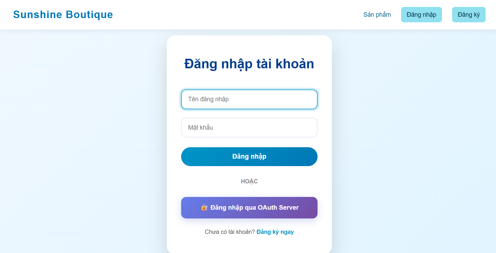

# OAUTH / OPENID CONNECT SYSTEM

## 1. Goals and Objectives

### 1.1. Goal (Mục tiêu tổng quát)
Xây dựng một **hệ thống OAuth 2.0 và OpenID Connect hoàn chỉnh**, bao gồm:
- **Authorization Server** (máy chủ xác thực & cấp phát token)
- **Client Application** (ứng dụng client sử dụng cơ chế OAuth/OIDC)

Hệ thống mô phỏng cơ chế **xác thực (Authentication)** và **uỷ quyền (Authorization)** hiện đại, giúp người dùng đăng nhập thông qua OAuth/OpenID Connect thay vì tài khoản cục bộ, từ đó:
- Tăng bảo mật
- Dễ mở rộng cho nhiều ứng dụng client
- Cải thiện trải nghiệm đăng nhập (SSO)

---

### 1.2. Objectives (Mục tiêu cụ thể)

#### 1.2.1. Authorization Server
Authorization Server cần đáp ứng:
- Xác thực người dùng (Login)
- Cấp **Authorization Code**
- Đổi **Authorization Code** lấy **Access Token**
- Cấp **ID Token** theo chuẩn OpenID Connect
- Quản lý thông tin định danh (User/Claims)
- Đảm bảo luồng đúng chuẩn OAuth 2.0 / OpenID Connect

#### 1.2.2. Client Application
Client Application cần:
- Redirect người dùng sang Authorization Server để đăng nhập
- Nhận Authorization Code và thực hiện trao đổi lấy token
- Lưu phiên đăng nhập (session) và hiển thị thông tin người dùng
- Minh hoạ việc áp dụng OAuth/OIDC vào ứng dụng web thực tế

#### 1.2.3. Ứng dụng minh hoạ
Một **website bán hàng thời trang** được xây dựng để:
- Đóng vai trò **Client Application minh hoạ**
- Mô phỏng kịch bản người dùng đăng nhập và sử dụng hệ thống sau xác thực
- Thể hiện tích hợp OAuth/OIDC vào một web ứng dụng thực tế
  

---

### 1.3. Technical Objectives (Mục tiêu kỹ thuật)
- Áp dụng chuẩn **OAuth 2.0 Authorization Code Flow**
- Áp dụng chuẩn **OpenID Connect** để xác thực danh tính
- Tách biệt rõ **Authorization Server** và **Client Application**
- Token/phiên làm việc rõ ràng, dễ kiểm thử
- Có thể mở rộng thêm nhiều client trong tương lai

---

## 2. System Overview

### 2.1. Authorization Server
Authorization Server chịu trách nhiệm:
- Xác thực người dùng
- Cấp Authorization Code
- Cấp Access Token
- Cấp ID Token (OIDC)
- Cung cấp thông tin người dùng (claims) cho Client theo token

### 2.2. Client Application (Website bán hàng thời trang)
Client Application sử dụng Authorization Server để:
- Cho người dùng đăng nhập bằng OAuth/OIDC
- Sau đăng nhập, người dùng có thể sử dụng các tính năng của website (mua sắm/đơn hàng...)
- Có trang quản trị (admin) phục vụ quản lý đơn hàng, doanh thu... (phần minh hoạ)

---

## 3. Technologies Used
- **Ngôn ngữ:** JavaScript
- **Backend:** Node.js, Express
- **OAuth/OIDC:** Authorization Code Flow, ID Token, Access Token
- **Database:** SQLite
- **Template Engine:** EJS
- **Frontend:** HTML, CSS
- **Session:** express-session

---

## 4. Key Features (Tính năng chính)

### 4.1. Authorization Server
- Đăng nhập người dùng (Authentication)
- Cấp Authorization Code
- Token endpoint: đổi code lấy Access Token / ID Token
- (Tuỳ triển khai) userinfo/claims lấy thông tin user dựa trên token

### 4.2. Client Application (Web bán hàng thời trang - minh hoạ)
- Trang sản phẩm, xem chi tiết sản phẩm
- Giỏ hàng, đặt hàng, xem đơn mua
- Đánh giá sản phẩm theo đơn hàng (review)
- Luồng hoàn hàng cơ bản (return request) 
- Admin: quản lý đơn hàng, sản phẩm, thống kê doanh thu 

---

## 5. Authentication Flow Overview
Luồng xác thực OAuth 2.0 / OpenID Connect:
1. Người dùng truy cập Client Application
2. Client redirect sang Authorization Server
3. Người dùng đăng nhập tại Authorization Server
4. Authorization Server trả về Authorization Code
5. Client đổi Authorization Code lấy Access Token + ID Token
6. Client tạo phiên đăng nhập và cho phép truy cập hệ thống

---

## 6. Installation & Run (Cài đặt và chạy dự án)

### 6.1. Yêu cầu môi trường
- Node.js (khuyến nghị >= 16)
- npm (đi kèm Node.js)

### 6.2. Cài đặt dependencies
Mở terminal tại thư mục dự án:

```bash
cd SE2025-2.3
cd client-app
npm install
```
### 6.3. Chạy Client Application (web bán hàng)
```bash
node start_server.js
```

---

## 7. Demo Accounts (Tài khoản demo)

Admin:

username: admin

password: 123456

---

## 8. Contribution
Vũ Quang Huy - 22001595
- Thiết kế & triển khai Authorization Server (OAuth 2.0 + OIDC)
- Luồng cấp code, token, id_token
- Tích hợp Client với Authorization Server
- Session, callback, xử lý token

Nguyễn Thị Minh Hằng - 22001575
- Xây dựng website minh hoạ (UI/DB sản phẩm, giỏ hàng, đơn hàng, admin dashboard)
- Kiểm thử, viết tài liệu, tổng hợp báo cáo

---

## 9. Conclusion

Đồ án đã xây dựng thành công một hệ thống OAuth / OpenID Connect hoàn chỉnh gồm Authorization Server và Client Application.
Website bán hàng thời trang được sử dụng như một ứng dụng minh hoạ để chứng minh khả năng tích hợp OAuth/OIDC vào một hệ thống web thực tế.

## 10. References

OAuth 2.0 Specification

OpenID Connect Core Specification

Node.js Documentation

Express.js Documentation
